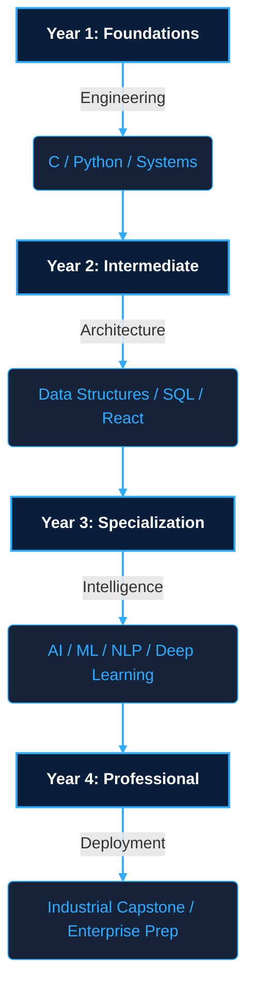

  
  
  

---

**Second-Year B.Tech Student in AI/ML at Manav Rachna University**

I am a passionate technologist focused on building strong computer science foundations, studying machine learning models, and exploring Linux systems and web development.

### ⚡ Who I Am

- 🎓 **Education**: Pursuing B.Tech in Artificial Intelligence & Machine Learning at Manav Rachna University (2nd Year).
- 🧠 **Interests**: Machine Learning, Systems Programming, and Web Development.
- 🌱 **Learning**: Exploring deep neural networks, Linux environments, and clean code architecture.
- 💬 **Ask Me About**: Python, Linux scripting, and React.

 

<table align="center" width="100%">
  <tr>
    <td align="center" width="33%" valign="top">
      <strong>💻 Languages & Systems</strong>  
       
       
       
       
       
      
    </td>
    <td align="center" width="34%" valign="top">
      <strong>🤖 AI / ML Engineering</strong>  
       
       
       
       
       
      
    </td>
    <td align="center" width="33%" valign="top">
      <strong>🎨 Frontend Development</strong>  
       
       
       
      
    </td>
  </tr>
  <tr>
    <td align="center" valign="top"> 
      <strong>⚙️ Backend & Databases</strong>  
       
       
       
      
    </td>
    <td align="center" valign="top"> 
      <strong>🐧 Systems & Infrastructure</strong>  
       
       
       
      
    </td>
    <td align="center" valign="top"> 
      <strong>🔧 Tools & Environments</strong>  
       
       
       
      
    </td>
  </tr>
  <tr>
    <td align="center" colspan="3" valign="top"> 
      <strong>🖌️ Design, Media & Engineering Tools</strong>  
      
      
      
      
    </td>
  </tr>
</table>

 

| ▣ Project | ❯ Description | ❯ Tech Stack | ❯ Status |
| :--- | :--- | :--- | :--- |
| **[EduNexus 🔗](https://github.com/auralumenor/EduNexus)** | Developed an enterprise-grade library management system. Engineered database schemas in PostgreSQL, implemented secure backend APIs, and built a real-time admin tracking dashboard. | `React` `Node.js` `Express` `PostgreSQL` | `🟢 Active` |
| **[Personal Portfolio 🔗](https://ramanraj.netlify.app/)** | Created a high-performance, responsive portfolio showcasing personal projects. Optimized asset loading and integrated CI/CD deployment via Netlify. | `HTML5` `CSS3` `JavaScript` | `🟢 Live` |
| **Advanced Systems Calculator** | Programmed a modular command-line scientific calculator in C, implementing custom operator precedence parsing and secure memory allocation. | `C Language` | `🔵 Completed` |
| **Linux Ecosystem Audit** | Authored Bash administrative scripts using AWK/sed text processing to automate performance monitoring and system audit reports. | `Bash` `Vim` `Linux` | `🔵 Completed` |
| **House Price Prediction** | Built a supervised machine learning model. Cleaned Ames housing data, performed feature engineering, and trained/tuned regression algorithms in Scikit-Learn. | `Python` `Scikit-Learn` `Pandas` | `🔵 Completed` |

 

 

 

 

 

#### 📈 Contribution History & Breakdown

<picture>
  <source media="(prefers-color-scheme: dark)" srcset="https://raw.githubusercontent.com/auralumenor/auralumenor/main/profile-summary-card-output/github_dark/0-profile-details.svg" />
  <source media="(prefers-color-scheme: light)" srcset="https://raw.githubusercontent.com/auralumenor/auralumenor/main/profile-summary-card-output/github/0-profile-details.svg" />
  
</picture>

 

<picture>
  <source media="(prefers-color-scheme: dark)" srcset="https://raw.githubusercontent.com/auralumenor/auralumenor/main/profile-summary-card-output/github_dark/1-repos-per-language.svg" />
  <source media="(prefers-color-scheme: light)" srcset="https://raw.githubusercontent.com/auralumenor/auralumenor/main/profile-summary-card-output/github/1-repos-per-language.svg" />
  
</picture>
<picture>
  <source media="(prefers-color-scheme: dark)" srcset="https://raw.githubusercontent.com/auralumenor/auralumenor/main/profile-summary-card-output/github_dark/2-most-commit-language.svg" />
  <source media="(prefers-color-scheme: light)" srcset="https://raw.githubusercontent.com/auralumenor/auralumenor/main/profile-summary-card-output/github/2-most-commit-language.svg" />
  
</picture>

 

### 🎮 Contribution Snake

<picture>
  <source media="(prefers-color-scheme: dark)" srcset="https://raw.githubusercontent.com/auralumenor/auralumenor/output/github-contribution-grid-snake-dark.svg" />
  <source media="(prefers-color-scheme: light)" srcset="https://raw.githubusercontent.com/auralumenor/auralumenor/output/github-contribution-grid-snake.svg" />
  
</picture>

  

 

_Designed with ❤️ by [auralumenor](https://github.com/auralumenor)_

