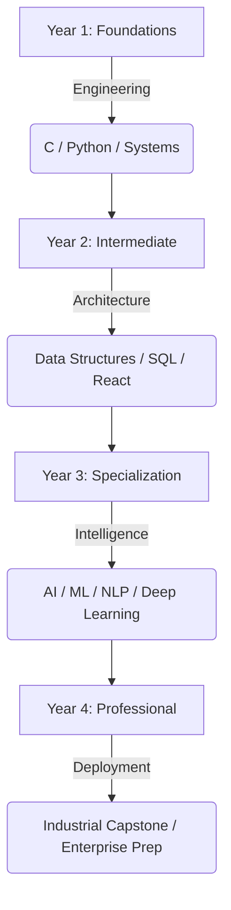

---

**First-Year AI/ML Student at Manav Rachna University | Architecting Scalable Technical Solutions**

I am a passionate technologist currently pursuing my B.Tech in AI/ML at **Manav Rachna University**. My journey is focused on building robust foundations in Computer Science, exploring the intersection of **AI/ML**, **Modern Web Development**, and **Systems Engineering**. I am dedicated to mastering the core principles of algorithms and data structures while engineering enterprise-ready applications and continuous system solutions.

[`◆ Portfolio`](https://ramanraj.netlify.app/) • [`◆ Contact`](mailto:rr737902@gmail.com) • [`◆ LinkedIn`](https://linkedin.com/in/ramanraj-ai)

 

<table align="center">
  <tr>
    <td align="center" width="20%">
      <strong>◈ Languages</strong>  
       
       
       
       
      
    </td>
    <td align="center" width="20%">
      <strong>◈ AI / ML</strong>  
       
       
       
      
    </td>
    <td align="center" width="20%">
      <strong>◈ Frontend</strong>  
       
       
       
      
    </td>
    <td align="center" width="20%">
      <strong>◈ Backend</strong>  
       
       
       
      
    </td>
    <td align="center" width="20%">
      <strong>◈ Tools</strong>  
       
       
       
       
       
      
    </td>
  </tr>
  <tr>
    <td align="center" colspan="2">
      <strong>◈ Design & Media</strong>  
      
      
      
      
    </td>
    <td align="center" colspan="3">
      <strong>◈ Systems & Infrastructure</strong>  
      
      
      
      
      
    </td>
  </tr>
</table>

 

| ▣ Project | ❯ Description | ❯ Stack |
| :--- | :--- | :--- |
| **[EduNexus](https://github.com/auralumenor/EduNexus)** | Enterprise-grade Library Management System with real-time tracking and dashboard analytics. | React, Node.js, Express, SQL |
| **[Personal Portfolio](https://ramanraj.netlify.app/)** | Professional technical landing page featuring minimalist design and responsive architecture. | HTML, CSS, JS |
| **Advanced Systems Calculator** | Scientific & Trigonometric calculator built to demonstrate complex logic handling in C. | C Language |
| **Linux Ecosystem Audit** | Systems management and text processing using Vim and advanced shell scripting. | Bash, Vim, Linux |
| **House Price Prediction** | House Price Predictor built to predict price of the house by using Ames_Housing_Dataset. | Python |

 

  

 

<table align="center">
  <tr>
    <td align="center">
      
    </td>
    <td align="center">
      
    </td>
  </tr>
  <tr>
    <td align="center">
      
    </td>
    <td align="center">
      
    </td>
  </tr>
</table>

  

 

 

> *“Engineering is not just about building; it is about sustaining and evolving.”*

My methodology revolves around the principle of **Continuous Systems Development**—an iterative approach to software engineering that prioritizes **scalability**, **maintainability**, and **algorithmic efficiency**. By bridging the gap between theoretical AI/ML models and production-ready systems, I aim to create technology that adapts and thrives in dynamic environments.

 

